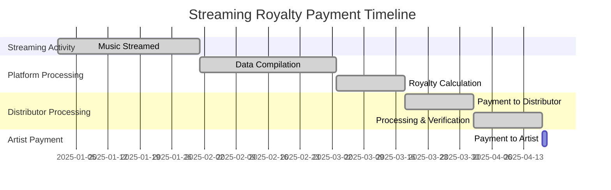

> Understanding how streaming royalties work can help you make better decisions about your music career and set realistic expectations for your earnings.
{: .prompt-tip }

When your music goes live on streaming platforms, several different revenue streams start working in the background. Each stream, download, and play generates royalties, but the path from listener to your bank account involves multiple steps and different types of payments.

## Types of Streaming Royalties

### Definition Overview

Mechanical Royalties
: Generated when your music is reproduced or distributed on streaming platforms

Performance Royalties
: Collected when your music is "performed" publicly, including through streaming

Neighboring Rights
: Compensate performers and sound recording copyright holders for digital performances

> The key to maximizing your streaming income is understanding that multiple royalty types work simultaneously for each play of your music.

### Mechanical Royalties
These are generated when your music is reproduced or distributed. On streaming platforms, mechanical royalties are paid each time someone streams your song. The rate varies by platform and country, but it's typically a fraction of a cent per stream.

### Performance Royalties
Performance royalties are collected when your music is "performed" publicly - which includes streaming. These royalties are typically collected by Performance Rights Organizations (PROs) like `ASCAP`, `BMI`, or `SESAC` in the United States.

> Remember: Performance royalties are separate from your distributor payments and require PRO registration to collect.
{: .prompt-warning }

### Neighboring Rights
Also called "related rights," these royalties compensate performers and sound recording copyright holders when their recordings are played on digital radio, satellite radio, or certain streaming services.

## Platform-Specific Revenue Streams

| Platform | Primary Revenue Type | Typical Payout Rate | Payment Model |
|:---------|:---------------------|:--------------------|:--------------|
| Spotify | Subscription + Ad Revenue | $0.003 - $0.005 | Pro-rata |
| Apple Music | Subscription Revenue | $0.007 - $0.01 | Pro-rata |
| YouTube Music | Subscription + Ads | $0.001 - $0.003 | User-centric |
| Amazon Music | Subscription Revenue | $0.004 - $0.007 | Pro-rata |

### Spotify
- **Free tier streams**: Lower payout rates due to ad-supported model
- **Premium streams**: Higher rates from subscription revenue  
- **Spotify for Artists**: Additional promotional tools but no direct revenue impact

### Apple Music
- **Subscription streams**: Generally higher per-stream rates than ad-supported platforms
- **iTunes downloads**: Separate revenue from digital sales (when available)

> Apple Music consistently offers some of the highest per-stream rates among major platforms due to their subscription-focused model.
{: .prompt-info }

### YouTube
- **YouTube Music**: Subscription-based streaming revenue
- **Regular YouTube**: Ad revenue sharing through Content ID
- **YouTube Premium**: Higher rates from premium subscriber streams

### Amazon Music  
- **Amazon Music Unlimited**: Subscription-based streaming
- **Amazon Prime Music**: Lower rates due to bundled service model

## Payout Timelines and Schedules

### Monthly Reporting Cycles
Most streaming platforms operate on monthly cycles:

1. **Month 1**: Your music is streamed
2. **Month 2**: Platforms compile data and calculate royalties  
3. **Month 3**: Distributors receive payments from platforms
4. **Month 4**: You receive payment from your distributor

> The 60-90 day delay between streams and payments is industry standard and allows time for data verification and fraud prevention.
{: .prompt-info }

### Distributor Payment Schedules
Different distributors have varying payment schedules:
- **Monthly payments**: Some distributors pay monthly once you meet minimum thresholds
- **Quarterly payments**: Others consolidate payments every three months
- **Minimum thresholds**: Many require $10-50 in earnings before issuing payments

### International Delays
Payments from international territories often take longer to process due to:
- Currency conversion requirements
- Local reporting regulations  
- Additional verification steps

## Factors That Affect Your Earnings

### Geographic Revenue Distribution

| Market Tier | Example Countries | Relative Payout Rate | Subscription Pricing |
|:------------|:------------------|:--------------------|:---------------------|
| Tier 1 | US, UK, Germany, Canada | 100% (baseline) | $9.99 - $14.99/month |
| Tier 2 | Spain, Italy, Japan | 60-80% | $6.99 - $9.99/month |
| Tier 3 | Brazil, Mexico, India | 20-40% | $1.99 - $4.99/month |

### Revenue Calculation Example

Let's say your song gets 1,000 streams across different markets:

- **500 streams from US listeners**: 500 × $0.004 = $2.00
- **300 streams from UK listeners**: 300 × $0.0035 = $1.05  
- **200 streams from India**: 200 × $0.0008 = $0.16

**Total earnings**: $3.21 for 1,000 streams

### Subscription vs. Free Listening
- **Premium subscribers**: Generate higher royalties per stream
- **Free/ad-supported**: Lower rates but potentially higher volume
- **Family plans**: Shared subscription revenue affects individual stream value

> Ad-supported streams typically generate 10-15% of what premium streams pay, but free users often stream more frequently.
{: .prompt-warning }

### Track Length and Completion Rates

#### The 30-Second Rule
Most platforms require at least 30 seconds of listening to count as a paid stream. This means:

- Tracks under 30 seconds earn reduced royalties
- Instrumental intros don't count toward streaming revenue
- Skip rates within the first 30 seconds eliminate potential earnings

> Songs that consistently get skipped before 30 seconds may see reduced algorithmic promotion on platforms like Spotify.
{: .prompt-danger }

### Release Strategy Impact
- **Album vs. single releases**: Albums may generate more total revenue but individual track performance varies
- **Release timing**: Competition and seasonal trends affect discovery
- **Catalog depth**: Larger catalogs typically generate more consistent revenue

## Maximizing Your Royalty Collection

### Essential Setup Checklist

- [ ] **Register with a PRO** - Sign up with ASCAP, BMI, or SESAC
- [ ] **Verify distributor settings** - Confirm all territories are enabled  
- [ ] **Set up publishing admin** - Consider services like Songtrust or CD Baby Pro
- [ ] **Register international** - Sign up with foreign PROs for global collection
- [ ] **Monitor analytics monthly** - Track performance across all platforms

### Register with a PRO
Make sure you're registered with a Performance Rights Organization to collect performance royalties. This is separate from your streaming revenue and represents additional income.

### Consider Publishing Administration
Publishing administrators can help collect mechanical royalties and other revenue streams you might miss as an independent artist.

### Monitor Your Analytics  
Regular review of your streaming data helps you understand:
- Which territories generate the most revenue
- Peak listening times and days
- Demographic information about your audience

### Diversify Your Platforms
Don't rely solely on one streaming service. Different platforms perform better in different regions and demographics.

## Common Misconceptions

> Many artists have unrealistic expectations about streaming revenue. Understanding these misconceptions helps set proper expectations.

### "Per-Stream" Rates Are Fixed
Streaming payouts fluctuate based on total platform revenue, subscriber numbers, and regional factors. There's no fixed rate per stream.

### All Streams Are Equal  
A stream from a premium subscriber in the US generates more revenue than a free-tier stream from a market with lower subscription prices.

### Immediate Payments
The lag between streams and payments is normal and built into the system. This delay allows platforms time to verify plays and calculate accurate royalties.

## Planning Your Expectations

### Revenue Projection Formula

To estimate monthly streaming income, use this calculation:

$
\text{Monthly Revenue} = \text{Monthly Streams} \times \text{Average Per-Stream Rate} \times \text{Collection Efficiency}
$

Where:
- **Monthly Streams**: Your projected monthly play count
- **Average Per-Stream Rate**: Typically $0.003 - $0.005 across all platforms  
- **Collection Efficiency**: Usually 85-95% (accounting for uncollected royalties)

### Example Calculation

For an artist with 10,000 monthly streams:

$
\$30 = 10,000 \times \$0.004 \times 0.90
$

> This example assumes a 90% collection rate and $0.004 average per-stream rate across all platforms.
{: .prompt-info }

### Growth Timeline
Building substantial streaming revenue typically takes time. Focus on growing your audience alongside optimizing your royalty collection.

### Multiple Revenue Streams
Streaming royalties work best as part of a broader revenue strategy that includes live performances, merchandise, sync licensing, and direct fan support.

## Getting Started

Understanding your royalty sources helps you make informed decisions about your music career. While streaming won't make every artist wealthy, knowing how the system works allows you to optimize your approach and set realistic expectations.

Track your earnings across different platforms and territories to identify your most valuable audiences. This information guides your marketing efforts and helps you focus your promotional budget where it will have the greatest impact.

> **Pro Tip**: Set up your PRO registration and publishing administration before your first release to avoid missing any royalty collection opportunities.
{: .prompt-tip }

---

*Questions about your royalty statements or distribution analytics? Contact our support team for help interpreting your earnings data and optimizing your revenue collection.*